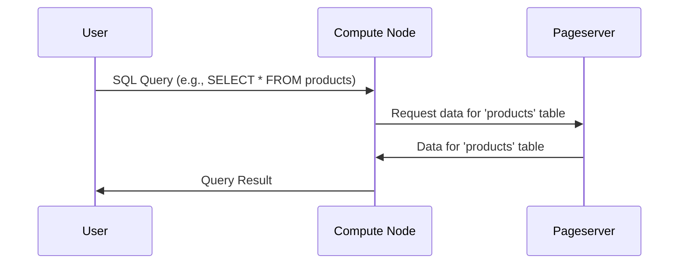

# Chapter 1: Compute Node

Welcome to the first step in understanding Neon! In this chapter, we'll explore a fundamental concept: the Compute Node.

Imagine you're using a database for your online store. You have lots of product information and customer orders stored there. As your store grows, more and more people are browsing and buying things, placing a heavy load on your database. Traditionally, you might need to upgrade your entire database server – both its processing power *and* its storage capacity – even if the main bottleneck is just the processing of queries. This can be expensive and inefficient.

That's where Neon's Compute Node comes in handy. It solves this problem by separating the compute (query processing) from the storage of data. This allows you to scale compute resources independently of storage.

**What is a Compute Node?**

Think of a Compute Node as a stateless PostgreSQL instance. This means it's a regular PostgreSQL server *without* its own data directory. It doesn't store any data itself. Instead, it retrieves the data it needs to execute queries from a separate storage service called the Pageserver (we'll talk more about the [Pageserver](04_pageserver_.md) later).

**Key benefits of using Compute Nodes:**

*   **Independent Scaling:** You can increase or decrease the number of Compute Nodes based on the query load, without affecting storage. This is super useful during peak shopping seasons!
*   **Cost Efficiency:** Pay only for the compute resources you need, when you need them.
*   **Flexibility:** Easily adjust compute capacity to match your workload demands.

**How it works**

Let's say a customer searches for "red shoes" on your online store. Here's how a Compute Node handles that request:

1.  The user's search query reaches the Compute Node.
2.  The Compute Node doesn't have the product data itself.
3.  It asks the Pageserver for the necessary data (product descriptions, images, prices, etc.).
4.  The Pageserver sends the data to the Compute Node.
5.  The Compute Node processes the data and finds the "red shoes".
6.  The Compute Node sends the search results back to the user.

**Simple Example**

Imagine you have a table called `products` with columns like `id`, `name`, and `price`.

```sql
SELECT name, price FROM products WHERE category = 'shoes';
```

When this query is executed on a Compute Node, it:

1.  Contacts the Pageserver to get the data for the `products` table.
2.  Filters the rows where `category` is 'shoes'.
3.  Returns the `name` and `price` for the matching products.

The Compute Node *doesn't* permanently store the `products` table data. It just fetches what it needs for that specific query.

**Under the Hood**

Let's take a simplified look at how this works internally.



Here’s a breakdown:

1.  **User:** Sends an SQL query to the Compute Node.
2.  **Compute Node (CN):** Receives the query.  It figures out what data it needs and sends a request to the Pageserver.
3.  **Pageserver (PS):** Receives the request and sends the requested data back to the Compute Node.
4.  **Compute Node (CN):** Processes the data and sends the query results back to the user.

**Code Snippets and Configuration**

While we won't dive into the nitty-gritty code right now, let's look at a few files that are relevant to the Compute Node. These files are used to build and configure the Compute Node image.

Here's an example snippet from `compute/vm-image-spec-bookworm.yaml`:

```yaml
  - name: postgres-exporter
    user: nobody
    sysvInitAction: respawn
    shell: 'DATA_SOURCE_NAME="user=cloud_admin sslmode=disable dbname=postgres application_name=postgres-exporter" /bin/postgres_exporter --config.file=/etc/postgres_exporter.yml'
```

This snippet sets up `postgres-exporter`, a tool used to collect metrics about the PostgreSQL instance running inside the Compute Node.  It defines the user under which the exporter runs and the command that starts the exporter.  `DATA_SOURCE_NAME` specifies the connection parameters to the database.

Another important file is `compute/compute-node.Dockerfile`, which defines how the Compute Node image is built. It includes instructions for installing PostgreSQL, the Neon extension, and other dependencies.

Here’s a simplified look:

```dockerfile
FROM debian:bookworm-slim

# Install necessary packages (simplified)
RUN apt-get update && apt-get install -y postgresql

# Copy configuration files
COPY etc /etc

# ... other steps to install Neon extensions and dependencies
```

This Dockerfile starts from a base Debian image, installs PostgreSQL, and then copies the necessary configuration files into the image. It also includes the Neon-specific extensions and other required dependencies to ensure that the Compute Node works correctly with the rest of the Neon system.

**Connecting to the Pageserver**

The Compute Node needs to know how to connect to the Pageserver to get the data. This is done through connection strings, which we'll explore in detail in the next chapter, [Connection Strings (pageserver_connstring, safekeepers_list)](02_connection_strings__pageserver_connstring__safekeepers_list__.md). These connection strings contain information like the Pageserver's address and the credentials needed to access it.

**Conclusion**

In this chapter, you've learned about the Compute Node, a fundamental building block of Neon's architecture. It's a stateless PostgreSQL instance that executes queries using data stored in the Pageserver, enabling independent scaling of compute and storage. In the next chapter, we'll dive into how these Compute Nodes connect to the Pageserver through connection strings.


---

Generated by [AI Codebase Knowledge Builder](https://github.com/The-Pocket/Tutorial-Codebase-Knowledge)