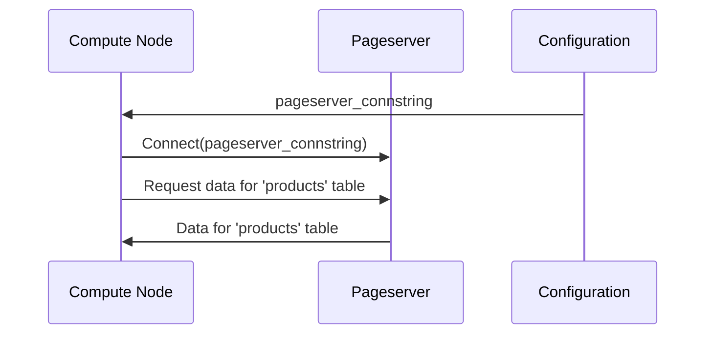

# Chapter 2: Connection Strings (pageserver_connstring, safekeepers_list)

In the previous chapter, [Compute Node](01_compute_node_.md), we learned that Compute Nodes are stateless PostgreSQL instances that rely on other services for data storage and management. But how do these Compute Nodes actually *find* and *connect* to those services? That's where connection strings come in!

Imagine you're building a house. You need to connect it to the electricity grid, the water supply, and the internet. Each of these connections requires specific information like the address of the service provider, the port number, and maybe a password. Connection strings are like those addresses and access codes, but for database services!

In the Neon architecture, we use connection strings to tell the Compute Node how to connect to the Pageserver (for data) and the Safekeepers (for Write-Ahead Log, or WAL). Without these connection details, the whole system wouldn't function.

**What are Connection Strings?**

A connection string is simply a set of instructions that a client (like a Compute Node) uses to connect to a server (like a Pageserver or a Safekeeper). It's usually a single string containing all the necessary information. In Neon, we configure these using GUCs (Grand Unified Configuration). Think of GUCs as settings that control how PostgreSQL behaves.

**Key Connection Strings in Neon**

We'll focus on two important connection strings:

1.  **`pageserver_connstring`**: This tells the Compute Node how to connect to the Pageserver.
2.  **`safekeepers_list`**: This tells the Compute Node how to find and connect to the Safekeepers.

Let's explore each one in more detail.

**1. `pageserver_connstring`**

This GUC holds the connection string for the Pageserver. It typically includes information like:

*   **Host**: The hostname or IP address of the Pageserver.
*   **Port**: The port number the Pageserver is listening on.
*   **Database Name**: The database to connect to (often `postgres` or a specific tenant database).
*   **User**: The username to use for authentication.
*   **Password (optional)**: The password for the user.  In Neon, this is often handled via environment variables for security.

**Example:**

```
host=pageserver.example.com port=5432 dbname=postgres user=cloud_admin sslmode=disable
```

**Explanation:**

This connection string tells the Compute Node to connect to the Pageserver at `pageserver.example.com` on port `5432`, using the `postgres` database, the `cloud_admin` user, and disabling SSL encryption (for simplicity in this example). `sslmode=disable` is NOT recommended for production.

**2. `safekeepers_list`**

This GUC specifies the list of Safekeepers the Compute Node should connect to.  Safekeepers ensure the durability and consistency of your data.  Unlike `pageserver_connstring`, `safekeepers_list` often contains *multiple* addresses, separated by commas.  This is because Neon uses multiple Safekeepers for redundancy and high availability.

Each entry in the `safekeepers_list` specifies the hostname and port of a Safekeeper.

**Example:**

```
safekeeper1.example.com:5433,safekeeper2.example.com:5433,safekeeper3.example.com:5433
```

**Explanation:**

This `safekeepers_list` tells the Compute Node that there are three Safekeepers: `safekeeper1.example.com`, `safekeeper2.example.com`, and `safekeeper3.example.com`, all listening on port `5433`.

**How Connection Strings Enable Communication**

Let's revisit the example of a customer searching for "red shoes" on your online store.  Here’s how connection strings play a role in that process:

1.  The user's search query reaches the Compute Node.
2.  The Compute Node needs to access the `products` table to find the "red shoes".
3.  The Compute Node uses the `pageserver_connstring` to connect to the Pageserver.
4.  The Compute Node sends a request to the Pageserver for the `products` table data.
5.  The Pageserver retrieves the data and sends it back to the Compute Node.
6.  The Compute Node processes the data and finds the "red shoes".
7.  The Compute Node, while processing the data, generates WAL (Write Ahead Log) to ensure data durability. It uses `safekeepers_list` to connect to the safekeepers and send WAL.
8.  The Compute Node sends the search results back to the user.

Without the correct `pageserver_connstring` and `safekeepers_list`, the Compute Node wouldn't be able to find the Pageserver or Safekeepers, and the search would fail!

**Under the Hood: How Connection Strings are Used**

Let's take a simplified look at how the Compute Node uses the `pageserver_connstring` internally.



Here's a breakdown:

1.  **Configuration:** Stores the `pageserver_connstring`. This could be a configuration file, environment variable, or GUC setting.
2.  **Compute Node (CN):** Reads the `pageserver_connstring` from the configuration.
3.  **Compute Node (CN):** Uses the connection string to establish a connection to the Pageserver (PS).
4.  **Compute Node (CN):** Sends a request to the Pageserver for data.
5.  **Pageserver (PS):** Sends the requested data back to the Compute Node.

**Code Snippets and Implementation**

Let's look at some code snippets from `pgxn\neon\libpagestore.c` that show how the `pageserver_connstring` is used.

```c
static char   *page_server_connstring;

DefineCustomStringVariable("neon.pageserver_connstring",
                           "connection string to the page server",
                           NULL,
                           &page_server_connstring,
                           "",
                           PGC_SIGHUP,
                           0,    /* no flags required */
                           CheckPageserverConnstring, AssignPageserverConnstring, NULL);
```

**Explanation:**

This code defines a GUC called `neon.pageserver_connstring`. The `DefineCustomStringVariable` function registers this GUC with PostgreSQL, allowing it to be configured. `page_server_connstring` is a global variable that will hold the value of the GUC. `CheckPageserverConnstring` and `AssignPageserverConnstring` are validation and assignment callbacks. `PGC_SIGHUP` means that the value can be reloaded at runtime, after running `pg_reload_conf()`.

```c
static void
load_shard_map(shardno_t shard_no, char *connstr_p, shardno_t *num_shards_p)
{
	// ... (Other code) ...
	if (connstr_p && shard_no < MAX_SHARDS)
		strlcpy(connstr_p, shard_map->connstring[shard_no], MAX_PAGESERVER_CONNSTRING_SIZE);
	// ... (Other code) ...
}
```

**Explanation:**

The `load_shard_map` function retrieves the connection string for a specific shard from shared memory. Sharding is a technique to distribute data across multiple Pageservers. It copies the connection string into `connstr_p`, which is then used to connect to the Pageserver.

Now let's look at some code snippets from `pgxn\neon\walproposer.c` that show how the `safekeepers_list` is used.

```c
typedef struct WalProposerConfig
{
	char	   *safekeepers_list;
	// ... other configurations
} WalProposerConfig;
```

**Explanation:**
This defines a configuration struct `WalProposerConfig` for the WAL proposer. The `safekeepers_list` field stores the connection string for the Safekeepers.

```c
WalProposer *
WalProposerCreate(WalProposerConfig *config, walproposer_api api)
{
    WalProposer *wp;

    wp = palloc0(sizeof(WalProposer));
    wp->config = config;
    wp_log(LOG, "neon.safekeepers=%s", wp->config->safekeepers_list);
	// ... (Other code) ...
	for (; host != NULL && *host != '\0'; host = sep)
	{
		// ... (Other code) ...
		wp->safekeeper[wp->n_safekeepers].host = host;
		wp->safekeeper[wp->n_safekeepers].port = port;
		// ... (Other code) ...
	}
	// ... (Other code) ...
}
```

**Explanation:**
This code shows how the `safekeepers_list` is parsed and used to populate the `WalProposer` struct. The `WalProposerCreate` function takes a `WalProposerConfig` as input and extracts the `safekeepers_list` from it. It then parses the comma-separated list of Safekeeper addresses and stores them in the `wp->safekeeper` array.

**Conclusion**

In this chapter, you've learned about connection strings and their crucial role in the Neon architecture. You've seen how `pageserver_connstring` and `safekeepers_list` enable Compute Nodes to connect to the Pageserver and Safekeepers, respectively. Understanding these connection strings is essential for configuring and troubleshooting your Neon deployments.

Next, we'll explore the concept of a [Timeline](03_timeline_.md), a fundamental abstraction for managing different versions of your data in Neon.


---

Generated by [AI Codebase Knowledge Builder](https://github.com/The-Pocket/Tutorial-Codebase-Knowledge)