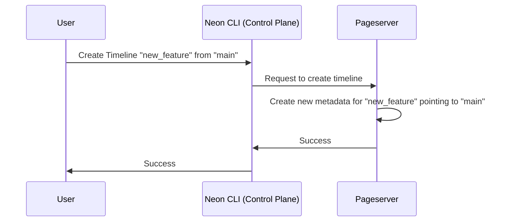

# Chapter 3: Timeline

In the previous chapter, [Connection Strings (pageserver_connstring, safekeepers_list)](02_connection_strings__pageserver_connstring__safekeepers_list__.md), we learned how Compute Nodes connect to the Pageserver and Safekeepers using connection strings. Now, let's explore a powerful feature of Neon that lets you manage different versions of your data: Timelines.

Imagine you're working on a new feature for your online store. You need to make some changes to the database schema to support this feature, like adding a new column to the `products` table. But you don't want to directly modify your production database, in case something goes wrong! That's where Timelines come in.

**What is a Timeline?**

A Timeline represents a branch in your data's history. Think of it like a Git branch, but for your database. Each timeline has its own independent history of changes. You can create new timelines from existing ones to experiment with new features, migrations, or any other changes without affecting your main production database.

**Key Benefits of Using Timelines**

*   **Safe Experimentation:** Test new features or database changes without risking your production data.
*   **Version Control for Data:** Easily manage different versions of your database schema and data.
*   **Point-in-Time Recovery:** Restore your database to a specific point in time.

**Creating a Timeline**

Let's say you have a production timeline called "main". To create a new timeline for your new feature, you would use the `neon timeline branch` command:

```sh
cargo neon timeline branch --branch-name new_feature
```

This command creates a new timeline called "new_feature" that is a copy of the "main" timeline at a specific point in time.

**Working on a Timeline**

Now you can connect to the "new_feature" timeline and make your changes. Any modifications you make to the database on this timeline will *not* affect the "main" timeline.

First create a new endpoint:

```sh
cargo neon endpoint create new_feature --branch-name new_feature
```

Then start the endpoint:

```sh
cargo neon endpoint start new_feature
```

Now you can connect to it:

```sh
psql -p [PORT_NUMBER] -h 127.0.0.1 -U cloud_admin postgres
```

You can find the `PORT_NUMBER` for the endpoint using this command:

```sh
cargo neon endpoint list
```

**Simple Example**

Let's add a new column called `discount` to the `products` table on the "new_feature" timeline:

```sql
ALTER TABLE products ADD COLUMN discount DECIMAL;
```

This change will only be applied to the "new_feature" timeline. The `products` table in the "main" timeline will remain unchanged.

**Merging Changes (Hypothetical)**

Once you're confident that your changes are working correctly, you *could* (in the future, Neon might support direct merges) migrate these changes to the main branch, for example by generating a database migration script.

**Under the Hood**

Here's a simplified look at how Timeline creation works internally:



Here’s a breakdown:

1.  **User:** Initiates timeline creation via the Neon CLI.
2.  **Neon CLI (Control Plane):**  Translates the command into an API request to the Pageserver.
3.  **Pageserver:** Creates a new timeline. The new timeline doesn't duplicate the data immediately. Instead, it keeps a pointer to the original timeline ("main" in this example) and only stores the *changes* made on the new timeline. This approach is called "copy-on-write" and makes timeline creation very fast and efficient.
4.  **Pageserver:** responds to the Neon CLI that the timeline has been created.
5.  **Neon CLI (Control Plane):** Notifies the user.

**Code Snippets**

Let's look at a code snippet from `pageserver/src/tenant/mgr.rs` that shows how timeline creation is handled.

```rust
pub async fn create_timeline(
    &self,
    req: TimelineCreateRequest,
    options: &CreateOptions,
) -> Result<Timeline, TenantTimelineError> {
    // ... (Other code to validate and prepare timeline) ...

    let timeline = Timeline::create(
        &self.config,
        req.new_timeline_id,
        req.ancestor_timeline_id,
        req.ancestor_start_lsn,
        self.remote_consistent_lsn_provider.clone(),
        self.gc_horizon,
        self.gc_period,
        options.pg_version,
        self.metric_labels.clone(),
    )?;

    // ... (Other code to persist the timeline metadata) ...

    Ok(timeline)
}
```

**Explanation:**

This Rust code shows the `create_timeline` function, which is part of the Pageserver's tenant manager. It receives a `TimelineCreateRequest` containing information about the new timeline, such as its ID, ancestor timeline, and starting LSN (Log Sequence Number). It then calls `Timeline::create` to actually create the timeline object and persists the timeline's metadata. Notice that there is no data copy here: new timeline references the old timeline using `ancestor_timeline_id` and `ancestor_start_lsn`.

**How Timelines Interact with other components**

Timelines are closely tied to the other components of Neon. For example:

*   **Compute Nodes:** When a Compute Node connects, it specifies the timeline it wants to use. The Compute Node then only sees the data associated with that timeline. The Compute Node connects to the [Pageserver](04_pageserver_.md) to fetch page versions for a specific timeline. The Pageserver uses the timeline ID to retrieve the correct version of the data.
*   **Pageserver:** The Pageserver stores the data for all timelines. It uses the timeline ID to keep track of which data belongs to which timeline.

**Conclusion**

In this chapter, you've learned about Timelines, a powerful feature of Neon that lets you manage different versions of your data. You've seen how to create new timelines, make changes to them without affecting your production data, and conceptually how to merge changes back into your main timeline. Understanding Timelines is essential for experimenting with new features and safely managing your database.

Next, we'll explore the [Pageserver](04_pageserver_.md), the component that stores all the data and serves it to the Compute Nodes.


---

Generated by [AI Codebase Knowledge Builder](https://github.com/The-Pocket/Tutorial-Codebase-Knowledge)