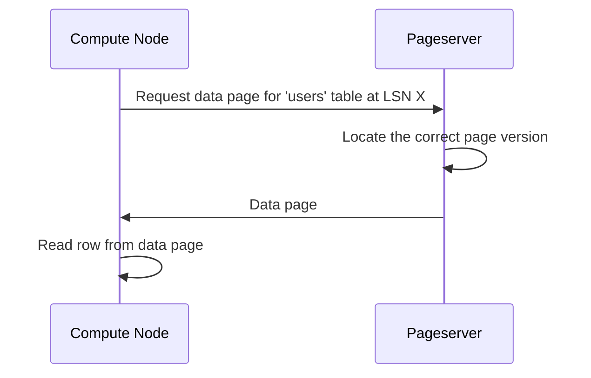

# Chapter 4: Pageserver

In the previous chapter, [Timeline](03_timeline_.md), we learned how timelines allow you to manage different versions of your data. Now, let's dive into the heart of Neon's storage system: the Pageserver!

Imagine you have a huge library filled with books (your database). Compute Nodes are like researchers who need to read these books to answer questions (queries). The Pageserver is like the librarian who manages all the books, knows where they are, and quickly provides them to the researchers when needed.

**What is the Pageserver?**

The Pageserver is the scalable storage backend in Neon. It's like a giant, distributed hard drive that stores all your data pages. Think of it as the central repository for all your database information.

**Why do we need a Pageserver?**

The Pageserver solves a crucial problem: how to efficiently store and serve data to multiple Compute Nodes. Without it, each Compute Node would need its own copy of the data, which would be wasteful and difficult to manage.

**Key Responsibilities of the Pageserver:**

1.  **Storing Data Pages:** The Pageserver stores the actual data of your database in pages. These pages are organized in layers for efficient storage and retrieval.
2.  **Serving Data to Compute Nodes:** When a Compute Node needs data, it sends a request to the Pageserver. The Pageserver locates the requested pages and sends them back to the Compute Node.
3.  **Managing Storage Layers:** The Pageserver manages different layers of storage, including base images and incremental changes, to efficiently store different versions of your data (remember [Timeline](03_timeline_.md)s?).
4.  **Providing Data at Specific LSNs:** A Log Sequence Number (LSN) is a unique identifier for a point in time in your database. The Pageserver can serve the correct version of a data page at a specific LSN, ensuring data consistency and enabling point-in-time recovery.

**Simple Example**

Let's say a Compute Node needs to read a row from a table called `users`. Here's how the Pageserver helps:

1.  The Compute Node sends a request to the Pageserver for the data page containing the `users` table row.
2.  The Pageserver finds the correct page version at the requested LSN.
3.  The Pageserver sends the data page to the Compute Node.
4.  The Compute Node reads the row from the received data page.

**Under the Hood: How it Works**

Let's visualize how the Compute Node and Pageserver interact:



Here’s a breakdown:

1.  **Compute Node (CN):** Sends a request to the Pageserver, specifying the data page and the LSN.
2.  **Pageserver (PS):** Locates the correct version of the data page.
3.  **Pageserver (PS):** Sends the data page to the Compute Node.
4.  **Compute Node (CN):** Reads the required data from the page.

**Code Snippets and Implementation**

Let's look at a simplified code snippet from `pageserver/src/page_service.rs` that shows how the Pageserver handles a request for a page:

```rust
async fn get_page_at_lsn(
    &self,
    tenant_id: TenantId,
    timeline_id: TimelineId,
    block_id: BlockId,
    lsn: Lsn,
) -> Result<Bytes> {
    // 1. Find the layer containing the requested page version.
    let layer = self.find_layer_for_block(tenant_id, timeline_id, block_id, lsn)?;

    // 2. Read the page from the layer.
    let page_bytes = layer.get_page(block_id)?;

    Ok(page_bytes)
}
```

**Explanation:**

This Rust code shows the `get_page_at_lsn` function, which is part of the Pageserver's page service. It receives a request for a page at a specific LSN.

1.  It first calls `find_layer_for_block` to locate the storage layer that contains the requested page version.
2.  Then, it calls `layer.get_page` to read the page data from the layer.
3.  Finally, it returns the page data as a `Bytes` object.

Let's look at a code snippet from `pageserver/src/tenant/layer.rs` that shows how a layer returns a page.

```rust
impl Layer {
    fn get_page(&self, block_id: BlockId) -> Result<Bytes> {
        // Read the page from the layer's file.
        let buf = self.read_page_from_file(block_id)?;
        Ok(buf)
    }
}
```

**Explanation:**

This Rust code shows the `get_page` function, which is part of the `Layer` implementation.

1.  It calls `read_page_from_file` to read the page data from the layer's file.
2.  Finally, it returns the page data as a `Bytes` object.

**How Timelines Interact with the Pageserver**

The Pageserver uses timeline IDs to manage data for different timelines. When a Compute Node requests data, it specifies the timeline ID. The Pageserver then uses this ID to retrieve the correct version of the data for that timeline.

This is why, in the previous chapter, when we created a new [Timeline](03_timeline_.md) called "new_feature," the changes we made on that timeline didn't affect the "main" timeline. The Pageserver kept the data for each timeline separate, accessible only when the correct timeline ID was specified.

**Conclusion**

In this chapter, you've learned about the Pageserver, the scalable storage backend that stores and serves data to Compute Nodes. You've seen how it stores data pages, manages storage layers, and provides data at specific LSNs. Understanding the Pageserver is crucial for understanding how Neon efficiently manages your database storage.

Next, we'll explore the [Safekeeper](05_safekeeper_.md), the component that ensures data durability in Neon.


---

Generated by [AI Codebase Knowledge Builder](https://github.com/The-Pocket/Tutorial-Codebase-Knowledge)