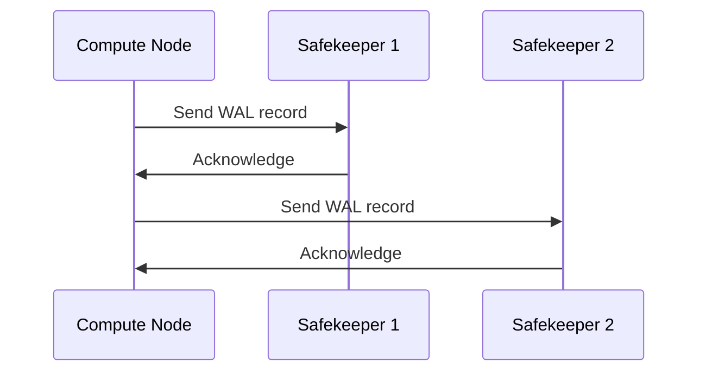

# Chapter 5: Safekeeper

In the previous chapter, [Pageserver](04_pageserver_.md), we learned how the Pageserver stores and serves data to the Compute Nodes. But what happens when the Compute Node makes changes to the data? How do we make sure those changes are safely and reliably stored, even if something goes wrong? That's where the Safekeeper comes in!

Imagine you're writing an important document on your computer. You type a few paragraphs, and then your computer suddenly crashes. If you haven't saved your work, you'll lose everything you've written. The Safekeeper is like an automatic save function for your database. It makes sure that all the changes you make are saved in a safe place, so you don't lose any data if something goes wrong.

**What is a Safekeeper?**

A Safekeeper is like a transaction log in traditional databases, but it's designed specifically for cloud environments. It receives Write-Ahead Log (WAL) records from the Compute Nodes, makes sure the WAL is stored durably, and provides the WAL to the Pageserver when needed.

**Why do we need a Safekeeper?**

The Safekeeper's main job is to ensure *data durability* and *availability*. Here's what that means:

*   **Data Durability:** This means that once a change is made to the database, it's guaranteed to be stored safely and won't be lost, even if there's a power outage, hardware failure, or other unexpected event.
*   **Data Availability:** This means that the data is always accessible when needed. The Safekeeper ensures that the Pageserver can always get the WAL it needs to reconstruct the latest state of the database.

Think of it like this: you don't want to rely on just one copy of your important document. You might save it to your computer, back it up to a USB drive, *and* upload it to the cloud. The Safekeepers are like those multiple backups, ensuring that your data is safe and available.

**Key Concepts**

1.  **WAL (Write-Ahead Log):** This is a record of all the changes made to the database. It's like a detailed history of every transaction.
2.  **Durability:** As mentioned above, this refers to the guarantee that data will be stored safely and reliably.
3.  **Redundancy:** Neon uses *multiple* Safekeepers. This means that if one Safekeeper fails, the other Safekeepers can still provide the WAL, ensuring data availability. The `safekeepers_list` GUC covered in [Connection Strings (pageserver_connstring, safekeepers_list)](02_connection_strings__pageserver_connstring__safekeepers_list__.md) is a comma-separated list of several safekeepers!

**How it Works**

Let's say a customer places an order on your online store. Here's how the Safekeeper ensures that this order is safely recorded in the database:

1.  The Compute Node receives the order and makes the necessary changes to the database.
2.  The Compute Node generates WAL records describing these changes.
3.  The Compute Node sends these WAL records to *all* of the Safekeepers (from `safekeepers_list`).
4.  Each Safekeeper stores the WAL records durably on disk.
5.  When the Pageserver needs to update its data, it requests the WAL records from the Safekeepers.
6.  The Safekeepers provide the WAL records to the Pageserver.
7.  The Pageserver applies the WAL records to update its data pages.

**Simple Example**

Imagine you have a table called `orders` with columns like `id`, `customer_id`, and `total`.

```sql
INSERT INTO orders (customer_id, total) VALUES (123, 45.67);
```

When this SQL statement is executed on a Compute Node:

1.  The Compute Node inserts a new row into the `orders` table.
2.  The Compute Node generates WAL records describing this insertion.
3.  The Compute Node sends these WAL records to the Safekeepers.
4.  The Safekeepers durably store the WAL records.

**Using the Safekeeper**

You don't directly interact with the Safekeeper. It works automatically behind the scenes. The important thing is to configure the Compute Node with the correct `safekeepers_list` connection string so that it knows where to send the WAL records. We covered `safekeepers_list` in [Connection Strings (pageserver_connstring, safekeepers_list)](02_connection_strings__pageserver_connstring__safekeepers_list__.md).

**Under the Hood**

Let's take a simplified look at how the Compute Node and Safekeepers interact.



Here’s a breakdown:

1.  **Compute Node (CN):** Sends a WAL record to each Safekeeper in the `safekeepers_list`.
2.  **Safekeeper 1 (SK1):** Receives the WAL record, stores it durably, and sends an acknowledgment back to the Compute Node.
3.  **Compute Node (CN):** Sends a WAL record to the next Safekeeper.
4.  **Safekeeper 2 (SK2):** Receives the WAL record, stores it durably, and sends an acknowledgment back to the Compute Node.

The Compute Node waits for acknowledgments from a *quorum* of Safekeepers before considering the WAL record to be safely stored. A quorum is a minimum number of Safekeepers that must acknowledge the WAL record. This ensures that even if one or more Safekeepers fail, the data is still safe.

**Code Snippets and Implementation**

Let's look at a simplified code snippet from `safekeeper/src/receive.rs` that shows how the Safekeeper receives WAL records:

```rust
async fn handle_message(
    &mut self,
    msg: &WalReceiverMessage,
) -> Result<(), anyhow::Error> {
    match msg {
        WalReceiverMessage::Append(append) => {
            // Store the WAL record to disk.
            self.wal_store.append(append.start_lsn, &append.wal_data).await?;

            // Acknowledge receipt.
            Ok(())
        }
        // ... other message types ...
    }
}
```

**Explanation:**

This Rust code shows the `handle_message` function, which is part of the Safekeeper's WAL receiver. It receives a `WalReceiverMessage`, which can be an `Append` message containing a WAL record. It then calls `self.wal_store.append` to store the WAL record to disk. Finally, it sends an acknowledgment back to the Compute Node (though that part is omitted for simplicity here). The `wal_store` ensures durable storage.

Let's look at a simplified code snippet from `safekeeper/src/wal_storage.rs` that shows how the Safekeeper stores WAL records:

```rust
async fn append(&self, lsn: Lsn, wal_data: &[u8]) -> Result<()> {
    // Write the WAL data to a file on disk.
    let mut file = OpenOptions::new()
        .append(true)
        .create(true)
        .open(self.wal_file_path)?;

    file.write_all(wal_data).await?;
    file.sync_all().await?; // This ensures the write is durable

    Ok(())
}
```

**Explanation:**

This Rust code shows the `append` function, which is part of the Safekeeper's WAL storage. It receives a WAL record and writes it to a file on disk. The `file.sync_all()` call is crucial because it ensures that the data is actually written to the physical disk and not just buffered in memory. This is what guarantees data durability.

**How Safekeepers Interact with Other Components**

*   **Compute Nodes:** The Compute Nodes are the primary clients of the Safekeepers. They send WAL records to the Safekeepers and receive acknowledgments.
*   **Pageserver:** The Pageserver retrieves WAL records from the Safekeepers to update its data pages. The Pageserver is the main consumer of the WAL data stored by the Safekeepers.

**Conclusion**

In this chapter, you've learned about the Safekeeper, a critical component of Neon that ensures data durability and availability. You've seen how it receives WAL records from Compute Nodes, stores them durably, and provides them to the Pageserver when needed. Understanding the Safekeeper is essential for understanding how Neon guarantees the safety and reliability of your data.

Next, we'll explore the [WAL Proposer](06_wal_proposer_.md), a component that helps to manage the consensus and replication of WAL data across multiple Safekeepers.


---

Generated by [AI Codebase Knowledge Builder](https://github.com/The-Pocket/Tutorial-Codebase-Knowledge)