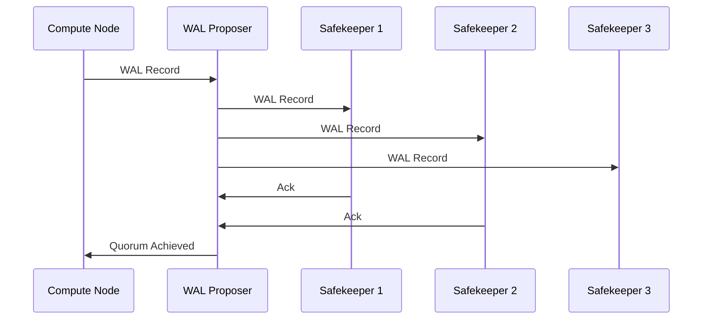

# Chapter 6: WAL Proposer

In the previous chapter, [Safekeeper](05_safekeeper_.md), we learned how Safekeepers durably store Write-Ahead Log (WAL) records. But how do we ensure that these WAL records are reliably sent from the Compute Node to the Safekeepers in the first place? And how do we handle situations where one or more Safekeepers might be temporarily unavailable? That's where the WAL Proposer comes in!

Imagine you are sending a very important package (WAL) to several recipients (Safekeepers). You want to make sure that at least a majority of them receive it, even if some of them are temporarily out of office (unavailable). The WAL Proposer is like a smart delivery service that handles this process for you. It ensures reliable delivery to a quorum of Safekeepers.

**What is the WAL Proposer?**

The WAL Proposer is responsible for receiving WAL from the Compute Node and reliably sending it to the Safekeepers. Think of it as a messenger ensuring your transaction data is replicated safely. It implements a consensus algorithm, meaning it makes sure that a *quorum* (a majority) of Safekeepers have acknowledged the WAL record before considering it safely stored.

**Key Concepts**

1.  **WAL (Write-Ahead Log):** A record of all changes made to the database, ensuring durability.
2.  **Safekeeper:** A storage node that durably stores WAL records.
3.  **Quorum:** A minimum number of Safekeepers that must acknowledge a WAL record for it to be considered safe. For example, if you have 3 Safekeepers, a quorum would be 2.
4.  **Consensus:** The process of agreeing on a single value (in this case, the order and content of WAL records) among a group of nodes.

**Use Case: Ensuring Reliable Replication**

Let's say a customer updates their address in your online store. Here's how the WAL Proposer ensures that this update is reliably replicated:

1.  The Compute Node receives the address update request.
2.  The Compute Node generates WAL records describing this update.
3.  The WAL Proposer receives these WAL records.
4.  The WAL Proposer sends the WAL records to all Safekeepers listed in the `safekeepers_list` connection string (we learned about this in [Connection Strings (pageserver_connstring, safekeepers_list)](02_connection_strings__pageserver_connstring__safekeepers_list__.md)).
5.  Each Safekeeper stores the WAL records and sends an acknowledgment back to the WAL Proposer.
6.  The WAL Proposer waits until it receives acknowledgments from a quorum of Safekeepers.
7.  Once a quorum is reached, the WAL Proposer considers the WAL records to be safely stored.
8.  The Compute Node can then confirm the address update to the customer.

Even if one of the Safekeepers is temporarily down, the WAL Proposer can still ensure the update is reliably replicated to the other Safekeepers in the quorum.

**Code Example (Conceptual)**

While you don't directly interact with the WAL Proposer, here's a conceptual example of what it does:

```
send_wal_to_safekeepers(wal_data, safekeeper_list) {
  // Send wal_data to each safekeeper in safekeeper_list
  // Wait for acknowledgments from a quorum of safekeepers
  // If quorum is reached, return success
  // Otherwise, return failure
}
```

This function is a simplified representation. In reality, there are many steps to establishing and maintaining connections, handling failures, and more.

**Under the Hood**

Let's take a look at how the WAL Proposer works internally.



Here's a breakdown of what happens:

1.  The **Compute Node (CN)** sends a WAL record to the **WAL Proposer (WP)**.
2.  The **WAL Proposer (WP)** sends the WAL record to each **Safekeeper (SK)** in its list (SK1, SK2, SK3 in this example).
3.  **Safekeeper 1 (SK1)** and **Safekeeper 2 (SK2)** acknowledge the WAL record.
4.  The **WAL Proposer (WP)** determines that a quorum has been achieved (2 out of 3 Safekeepers).
5.  The **WAL Proposer (WP)** notifies the **Compute Node (CN)** that the WAL record has been safely stored.

**Key Code Snippets**

Let's examine snippets from `pgxn\neon\walproposer.c` that illustrate the WAL Proposer's functionality:

```c
WalProposer *
WalProposerCreate(WalProposerConfig *config, walproposer_api api)
{
    // ... (Other code) ...
    wp->quorum = wp->n_safekeepers / 2 + 1;
    // ... (Other code) ...
}
```

This code calculates the quorum size based on the number of Safekeepers.  It divides the total number of Safekeepers by 2 and adds 1 to ensure a majority.

```c
void
WalProposerBroadcast(WalProposer *wp, XLogRecPtr startpos, XLogRecPtr endpos)
{
    // ... (Other code) ...
    BroadcastAppendRequest(wp);
}
```

This code broadcasts the WAL record to all connected Safekeepers using the `BroadcastAppendRequest` function.

```c
static void
BroadcastAppendRequest(WalProposer *wp)
{
    for (int i = 0; i < wp->n_safekeepers; i++)
        if (wp->safekeeper[i].state == SS_ACTIVE)
            SendMessageToNode(&wp->safekeeper[i]);
}
```

This function iterates through the list of safekeepers. If the safekeeper is in active state the messages are sent to it.

**Conclusion**

In this chapter, you've learned about the WAL Proposer, the component responsible for reliably replicating WAL records to Safekeepers. You've seen how it uses a consensus algorithm to ensure that a quorum of Safekeepers acknowledge each WAL record, guaranteeing data durability even in the face of failures. Understanding the WAL Proposer is crucial for understanding how Neon achieves high availability and data consistency.

Next, we'll explore [Neon Request LSNs (request_lsn, not_modified_since, effective_request_lsn)](07_neon_request_lsns__request_lsn__not_modified_since__effective_request_lsn__.md), diving deeper into how Compute Nodes request specific versions of data from the Pageserver using Log Sequence Numbers (LSNs).


---

Generated by [AI Codebase Knowledge Builder](https://github.com/The-Pocket/Tutorial-Codebase-Knowledge)