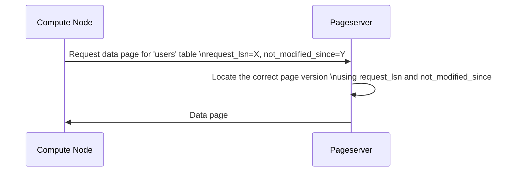

# Chapter 7: Neon Request LSNs (request_lsn, not_modified_since, effective_request_lsn)

In the previous chapter, [WAL Proposer](06_wal_proposer_.md), we explored how WAL records are reliably sent to Safekeepers. Now, let's shift our focus to how Compute Nodes request *specific versions* of data from the Pageserver. This is where Neon Request LSNs come in!

Imagine you're browsing a website and click the "refresh" button. You expect to see the latest version of the page, right? But sometimes, due to network delays or other factors, you might actually get a slightly older version. In Neon, we need a way to *precisely* request and retrieve the correct version of data pages, even in the presence of delays and concurrent updates. That's the central use case that Neon Request LSNs solve.

**The Problem: Getting the Right Data at the Right Time**

The Compute Node asks the Pageserver for data. But the Pageserver is constantly being updated with new data from WAL records coming from the Safekeepers. How does the Compute Node specify *which version* of the data it wants? And how can we optimize this process to avoid unnecessary delays?

**The Solution: Neon Request LSNs**

Neon uses a set of three Log Sequence Numbers (LSNs) to manage these requests:

1.  `request_lsn`: The target LSN. This is the *most important* LSN, as it specifies the exact version of the data the Compute Node wants.
2.  `not_modified_since`: An optimization hint. It tells the Pageserver that the data *probably* hasn't changed since this LSN.
3.  `effective_request_lsn`: The time when the request was issued.

Let's look at each one in detail.

**1. `request_lsn`: The Target Version**

The `request_lsn` is the core of the request. It tells the Pageserver: "Give me the data page as it existed at *this* specific point in time, identified by this LSN." Think of it like asking a librarian for a specific edition of a book.

For example, if the Compute Node wants the `products` table as it existed after transaction `X`, it would set `request_lsn` to the LSN of the WAL record for transaction `X`.

**2. `not_modified_since`: An Optimization Hint**

The `not_modified_since` LSN is an *optional* hint. It tells the Pageserver: "Hey, I *think* this data page hasn't changed since this LSN. If you have the page version at `not_modified_since` readily available, you can use it to speed up the search."

This is like telling the librarian: "I saw this book yesterday, and I *think* it was in the same place as of yesterday. Check there first!".

**Why is this useful?**

*   The Pageserver can potentially avoid waiting for WAL to arrive for LSNs *later* than `not_modified_since`.
*   The Pageserver can skip checking recent layers in its storage if it knows the data hasn't changed since `not_modified_since`.

**Important:** The Pageserver *must* still verify that the data is correct at the `request_lsn`. It cannot blindly trust the `not_modified_since` hint.

**3. `effective_request_lsn`: Remembering the Request Time**

The `effective_request_lsn` is used *internally* by the Compute Node. It is *not* sent to the Pageserver. It simply records *when* the request was made, especially when requesting the "latest" version of the data.

In a typical scenario, the `request_lsn` represents a fixed point in time. However, sometimes the Compute Node needs the *absolute latest* data available. In this case, `request_lsn` is set to `UINT64_MAX` (a very large number representing the maximum possible LSN), indicating "give me the latest".

Since `UINT64_MAX` doesn't represent a specific point in time, the `effective_request_lsn` remembers the *actual* LSN at the moment the request was made. This is important for prefetching and other internal optimizations.

**How It All Works Together**

Let's say a Compute Node wants to read a page from the `users` table. Here's how the Neon Request LSNs are used:

1.  The Compute Node determines the `request_lsn`. This could be a specific LSN from a previous transaction, or `UINT64_MAX` to request the latest version.
2.  The Compute Node sets the `not_modified_since` to a reasonable value (e.g., the last LSN it successfully read for that page).
3.  The Compute Node records the current LSN as `effective_request_lsn` if `request_lsn` is `UINT64_MAX`.
4.  The Compute Node sends the `request_lsn` and `not_modified_since` to the Pageserver.
5.  The Pageserver uses these LSNs to efficiently locate and return the correct page version.

**Code Example**

This snippet shows how the `neon_request_lsns` struct is defined.

```c
typedef struct
{
  XLogRecPtr request_lsn;
  XLogRecPtr not_modified_since;
  XLogRecPtr effective_request_lsn;
} neon_request_lsns;
```

This code defines a `neon_request_lsns` struct containing the `request_lsn`, `not_modified_since`, and `effective_request_lsn` members.

This snippet shows how to create the structure `neon_request_lsns`.

```c
neon_request_lsns lsns;
lsns.request_lsn = 12345;
lsns.not_modified_since = 10000;
lsns.effective_request_lsn = 12345;
```

This code creates a struct `lsns` of type `neon_request_lsns` and initializes its members to certain values.

**Under the Hood: Requesting Data with LSNs**

Let's see how these LSNs are used in the communication between the Compute Node and the Pageserver.



Here's a breakdown:

1.  **Compute Node (CN):** Sends a request to the Pageserver, including the `request_lsn` and `not_modified_since`.
2.  **Pageserver (PS):** Uses the `request_lsn` as the target LSN, and `not_modified_since` as optimization hint to find the correct page version.
3.  **Pageserver (PS):** Sends the data page to the Compute Node.

**Code Snippets and Implementation**

The `pgxn\neon\pagestore_client.h` file defines the `neon_request_lsns` struct.

```c
typedef struct
{
  XLogRecPtr request_lsn;
  XLogRecPtr not_modified_since;
  XLogRecPtr effective_request_lsn;
} neon_request_lsns;
```

This code defines a struct containing the request LSNs. `XLogRecPtr` is a data type defined by PostgreSQL for storing LSN values.

The `pgxn\neon\libpagestore.c` file uses the `neon_request_lsns` struct when making requests to the Pageserver.

The snippet below shows the struct defined at the beginning of the `pgxn\neon\pagestore_client.h` file for the GetPageRequest.

```c
typedef struct
{
 NeonRequest hdr;
 NRelFileInfo rinfo;
 ForkNumber forknum;
 BlockNumber blkno;
} NeonGetPageRequest;
```

The `NeonGetPageRequest` struct uses the `NeonRequest` struct, which contains the lsn and not_modified_since fields.

```c
typedef struct
{
 NeonMessageTag tag;
 NeonRequestId reqid;
 XLogRecPtr lsn;
 XLogRecPtr not_modified_since;
} NeonMessage;
```

**Conclusion**

In this chapter, you've learned about Neon Request LSNs and how they're used to precisely request data page versions from the Pageserver. You've seen how `request_lsn`, `not_modified_since`, and `effective_request_lsn` work together to ensure data consistency and optimize performance. Understanding these LSNs is crucial for understanding how Neon efficiently manages data retrieval.

Next, we'll explore the [Local File Cache (LFC)](08_local_file_cache__lfc__.md), a mechanism for caching frequently accessed data pages locally to further improve performance.


---

Generated by [AI Codebase Knowledge Builder](https://github.com/The-Pocket/Tutorial-Codebase-Knowledge)