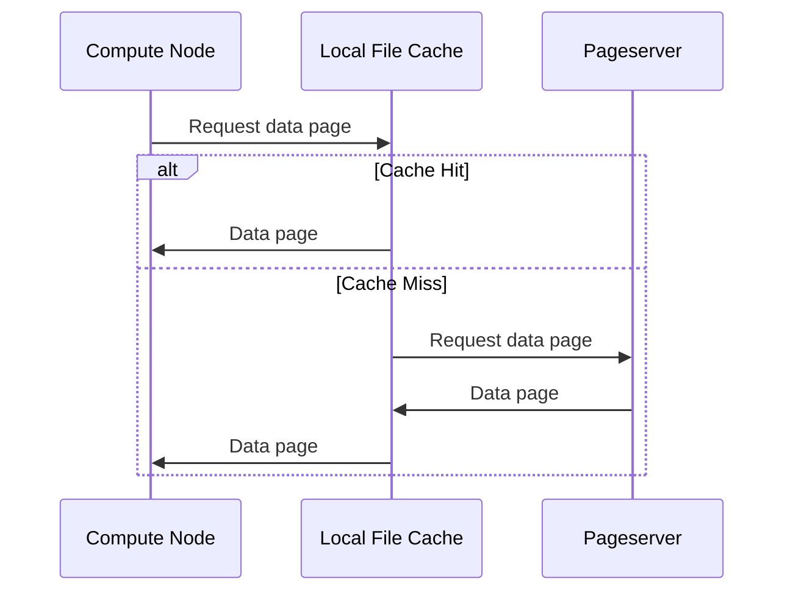

# Chapter 8: Local File Cache (LFC)

In the previous chapter, [Neon Request LSNs (request_lsn, not_modified_since, effective_request_lsn)](07_neon_request_lsns__request_lsn__not_modified_since__effective_request_lsn__.md), we explored how Compute Nodes request specific versions of data from the Pageserver using LSNs. Now, let's talk about how we can make those data requests even *faster* using a Local File Cache (LFC)!

Imagine you're a student frequently using specific textbooks for your studies. Instead of heading to the library (Pageserver) every time, you'd save a *lot* of time and effort by keeping copies of those frequently-used books right on your desk (LFC). That’s precisely what the Local File Cache (LFC) does for Neon!

**The Problem: Network Latency**

Even with efficient LSN-based requests, fetching data from the Pageserver involves network communication. This can introduce latency, especially if the Pageserver is located far away.  For frequently accessed data, this latency can become a bottleneck.

**The Solution: Local File Cache (LFC)**

The Local File Cache (LFC) is like a mini-Pageserver that sits right next to the Compute Node. It stores frequently-accessed data pages locally, reducing network trips and significantly improving query performance.  Think of it as a "data hot spot" for your Compute Node.

**Key Concepts**

1.  **Cache:** The LFC is a cache, meaning it's a temporary storage area for frequently used data.
2.  **Local:** The LFC is "local" because it resides on the same machine as the Compute Node, minimizing latency.
3.  **File:**  The LFC typically stores data in a single file on the local disk for efficient access.
4.  **Pages:** The LFC stores data in terms of "pages," which are the fundamental units of data storage in PostgreSQL (typically 8KB).
5. **LRU (Least Recently Used):** When the LFC is full, it needs to decide what data to remove to make space for new data. The LRU eviction policy removes the pages that haven't been used for the longest time.

**How it Works**

Let’s say a customer frequently views a particular product on your online store. Here's how the LFC speeds up the process:

1. The Compute Node receives the request to view the product.
2. The Compute Node *first* checks the LFC to see if the product's data page is already stored there.
   *   **If it's in the LFC (a cache hit):** The Compute Node retrieves the data directly from the LFC, bypassing the network and delivering the product details almost instantly.
   *   **If it's *not* in the LFC (a cache miss):** The Compute Node fetches the data from the Pageserver (as we learned in [Pageserver](04_pageserver_.md)).  The Compute Node also *stores* a copy of the retrieved data in the LFC, so it's readily available for future requests.

**Benefits**

*   **Reduced Latency:** Serving data from the LFC is much faster than fetching it over the network.
*   **Lower Network Traffic:**  Frequently-accessed data is served locally, reducing the load on the network and the Pageserver.
*   **Improved Query Performance:**  Overall query performance is significantly improved, especially for frequently accessed data.
*   **More Predictable Latency:** Even when the pageserver might be experiencing a high load, the LFC helps to keep latency more consistent.

**Using the LFC: Configuration**

You don't directly interact with the LFC in your SQL queries. It works automatically in the background.  However, you *can* configure its behavior using GUC parameters in `postgresql.conf`:

*   `neon.file_cache_size_limit`: This determines the maximum size of the LFC on disk, in megabytes (MB). A larger cache can store more data, increasing the likelihood of cache hits.
*   `neon.file_cache_path`: Specifies the path to the file on the local disk where the LFC data is stored.
*  `neon.max_file_cache_size`: This is the hard upper limit for the file cache size. `neon.file_cache_size_limit` cannot exceed this value.

**Example:**

```
neon.file_cache_size_limit = 1024  # 1 GB cache
neon.file_cache_path = '/mnt/fast_disk/lfc.cache'
neon.max_file_cache_size = 2048 # 2 GB max size
```

**Under the Hood: How it Works**

Here's a simplified look at how the Compute Node interacts with the LFC and the Pageserver:



Here's a breakdown:

1.  **Compute Node (CN):** Sends a request for a data page to the Local File Cache (LFC).
2.  **LFC:** Checks if the data page is present in its local storage.
    *   **If it's a cache hit:**  The LFC returns the data page directly to the Compute Node.
    *   **If it's a cache miss:** The LFC forwards the request to the Pageserver (PS).
3.  **Pageserver (PS):** Sends the data page to the LFC.
4.  **LFC:** Stores the data page locally and then returns it to the Compute Node.

**Code Snippets and Implementation**

Let's look at code from `pgxn\neon\file_cache.c` that shows how the LFC is used for reads.

```c
int
lfc_readv_select(NRelFileInfo rinfo, ForkNumber forkNum, BlockNumber blkno,
				 void **buffers, BlockNumber nblocks, bits8 *mask) {
  // ... code ...
  entry = hash_search_with_hash_value(lfc_hash, &tag, hash, HASH_FIND, NULL);

  if (entry == NULL) {
      // Pages are not cached
      lfc_ctl->misses += blocks_in_chunk;
      // ... code ...
  } else {
     // Pages are cached
     // ... code ...
  }
 // ... code ...
}
```

**Explanation:**

This code snippet shows the core logic for reading data from the LFC. `lfc_readv_select` checks if a given entry is in the LFC (the `hash_search_with_hash_value` function attempts to find the entry in the hash). If not found, it increments a miss counter.

Now, let's look at a code snippet from the same file that shows how the LFC is used for writes:

```c
void
lfc_writev(NRelFileInfo rinfo, ForkNumber forkNum, BlockNumber blkno,
		   const void *const *buffers, BlockNumber nblocks) {
 // ... code ...
 entry = hash_search_with_hash_value(lfc_hash, &tag, hash, HASH_ENTER, &found);
 if (found) {
  // ... code ...
 } else {
  // ... create new entry in cache
 }
 // ... code ...
}
```

**Explanation:**

This code snippet shows how the LFC writes are handled. The logic is similar: `lfc_writev` checks to see if an entry is already present. If so, it's used; otherwise, a new one is created.

**Conclusion**

In this chapter, you've learned about the Local File Cache (LFC) and how it improves Neon's performance by caching frequently accessed data locally. You've seen how it reduces network latency, lowers traffic, and improves overall query performance. Understanding the LFC is essential for optimizing your Neon deployments.

Now that you've seen the core components of the Neon architecture, let's explore how the compute nodes connect to the cluster. There is no next chapter in this tutorial.


---

Generated by [AI Codebase Knowledge Builder](https://github.com/The-Pocket/Tutorial-Codebase-Knowledge)