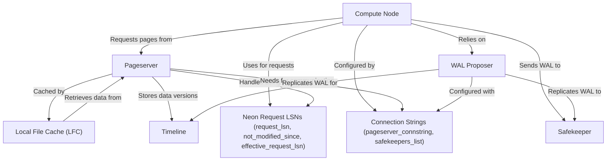

# Tutorial: neon

Neon is a serverless, open-source alternative to AWS Aurora Postgres. It **separates storage and compute**, enabling independent scaling and branching of data. The system uses *Pageservers* for scalable storage and *Safekeepers* for durable WAL management, allowing stateless *Compute Nodes* to efficiently execute queries.

**Source Repository:** [https://github.com/neondatabase/neon.git](https://github.com/neondatabase/neon.git)

## Chapters

1. [Compute Node
](01_compute_node_.md)
2. [Connection Strings (pageserver_connstring, safekeepers_list)
](02_connection_strings__pageserver_connstring__safekeepers_list__.md)
3. [Timeline
](03_timeline_.md)
4. [Pageserver
](04_pageserver_.md)
5. [Safekeeper
](05_safekeeper_.md)
6. [WAL Proposer
](06_wal_proposer_.md)
7. [Neon Request LSNs (request_lsn, not_modified_since, effective_request_lsn)
](07_neon_request_lsns__request_lsn__not_modified_since__effective_request_lsn__.md)
8. [Local File Cache (LFC)
](08_local_file_cache__lfc__.md)

---

Generated by [AI Codebase Knowledge Builder](https://github.com/The-Pocket/Tutorial-Codebase-Knowledge)